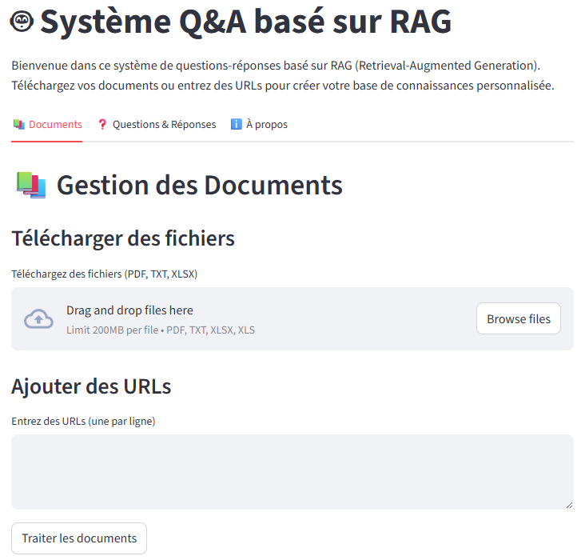

# 🤖 QnA Maker - Système Q&A basé sur RAG
[](https://qnamaker-agwp5zhkwmstzgasdvbxxa.streamlit.app/)
[](https://www.python.org/downloads/)
[](https://opensource.org/licenses/MIT)

Un système de questions-réponses basé sur la technologie RAG (Retrieval-Augmented Generation) qui vous permet de créer votre propre assistant IA à partir de vos documents personnels.

**🔗 Application déployée: [QnA Maker](https://qnamaker-agwp5zhkwmstzgasdvbxxa.streamlit.app/)**

## ✨ Fonctionnalités
- **📄 Support multi-formats**: Traitement de fichiers PDF, TXT, XLSX et URLs
- **🔍 Recherche sémantique**: Recherche de contenu par similarité vectorielle avec FAISS
- **🧠 Réponses intelligentes**: Génération de réponses contextuelles avec Groq LLM
- **🎤 Interface vocale**: Reconnaissance vocale pour les questions et synthèse vocale pour les réponses
- **🌐 Déploiement facile**: Accessible en ligne via Streamlit Cloud
## 🛠️ Comment ça marche
1. **Importation de documents**: Téléchargez vos fichiers ou entrez des URLs
2. **Traitement du contenu**: Le système divise les documents en chunks et génère des embeddings
3. **Indexation vectorielle**: Les embeddings sont stockés dans une base de données FAISS
4. **Recherche contextuelle**: Vos questions permettent de récupérer les chunks pertinents
5. **Génération de réponses**: Un modèle LLM (via Groq) génère des réponses précises basées sur le contexte
## 🚀 Installation pour développement local
1. **Cloner le dépôt**:
   ```bash
   git clone https://github.com/ab-ammari/qna_maker.git
   cd qnamaker